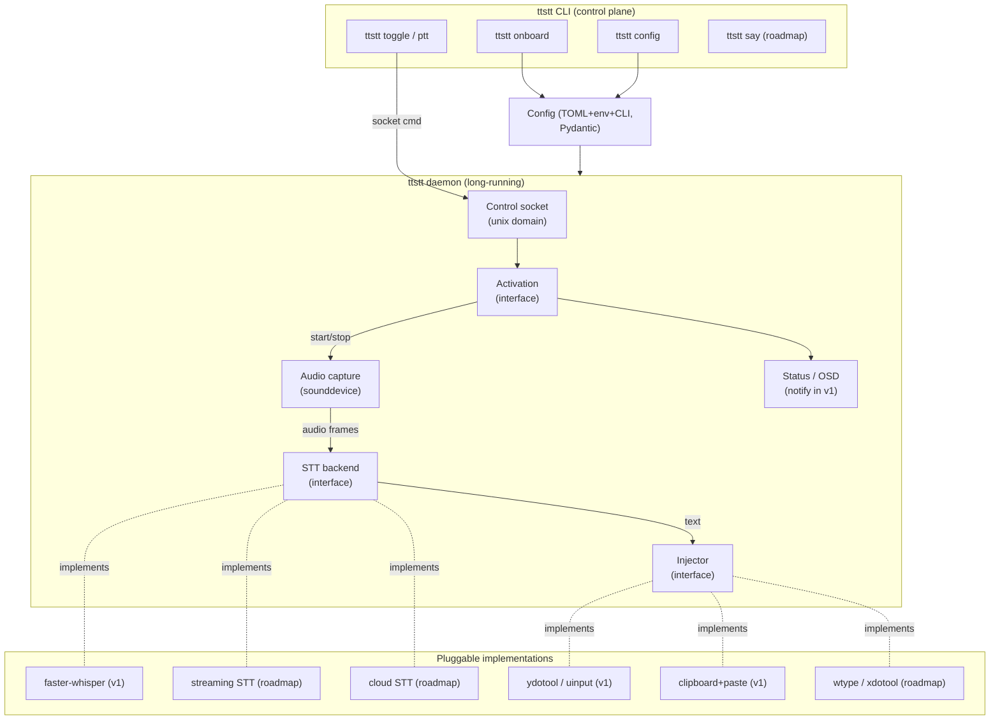
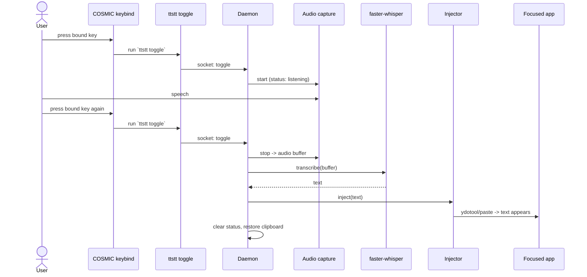

# feat: TTSTT — local-first modular voice toolkit (STT + TTS)

**Product Contract preservation:** Created by `ce-plan` (no upstream brainstorm). The Product Contract below was authored here from the user's request; treat it as the WHAT this plan commits to.

---

## Summary

TTSTT is a local-first, modular voice toolkit for Linux: speech-to-text (dictation) and
text-to-speech, with pluggable model backends that run locally on CPU/GPU/other accelerators
and connect to cloud providers through the same interface. It is built to be **readable and
hackable** in the spirit of Andrej Karpathy's recent work — minimal dependencies, explicit
over abstracted, few knobs with sensible derived defaults — while bending that teaching-repo
ethos where a real, long-lived tool demands it (layered config, error boundaries, tests,
packaging).

This plan delivers a **vertical slice** in implementation-ready detail — press a bound key,
speak, and have transcribed text injected into the focused application, end-to-end with
`faster-whisper` and `ydotool` — built on the modular seams (STT backend, injector,
activation, config) that the full feature set plugs into. It then sketches a **phased
roadmap** for the remaining capabilities (VAD, streaming, wake-word continuous listening,
TTS with custom voices, TUI/GUI, OSD, cloud adapters) so the whole arc is visible without
over-specifying work that the slice will inform.

---

## Goal Capsule

**For** a Linux power user (Wayland/COSMIC) who currently "gets by" with `voxtype`,
**TTSTT** is a voice toolkit **that** provides local-first dictation and speech synthesis
with swappable models and direct text injection, **unlike** whisper-flow / Monologue (cloud,
closed, non-Linux) and unlike the current ad-hoc setup, **because** it is owned, modular,
hackable, and local by default.

**v1 done means:** a daemon-backed dictation loop where a compositor-bound keystroke toggles
listening, speech is transcribed locally by `faster-whisper`, and the text is injected into
the focused app via `ydotool` (with clipboard-paste fast path) — installed and configured per
user by an onboarding command, on the user's COSMIC desktop.

---

## Problem Frame

The user wants to stop "getting by" with a patchwork dictation setup (`voxtype`, with
recurring COSMIC hotkey and GPU-device friction) and own a voice solution that is **local
first, modular, and hackable**. Comparable products (whisper-flow / Wispr Flow, Monologue)
are cloud, closed, and not Linux-native. The Linux OSS space has strong *pieces* —
`faster-whisper`, Silero VAD, openWakeWord, Kokoro, Chatterbox, `ydotool` — but **no tool
composes them** into a local-first package with all the activation modes (PTT, toggle, VAD,
passive continuous + wake word), streaming-by-default STT, first-class local TTS (base +
custom voices), direct Wayland/X11 injection, and a per-user onboarding + TUI/GUI/OSD surface.
TTSTT is that composition.

Two environment realities constrain the design from day one (both confirmed from the user's
notes):
- **COSMIC does not reliably expose the Wayland virtual-keyboard protocol**, so naive `wtype`
  injection fails; `ydotool`/uinput is the only dependable route on the target desktop.
- **Global hotkeys on Wayland/COSMIC are restricted**, and the user has hit COSMIC keybind
  pain before — so activation must be a daemon + control-CLI bound to a compositor shortcut,
  not an in-process global hotkey grab.

---

## Product Contract

### Actors

- **A1 — Dictating user.** A single Linux desktop user who triggers dictation and expects text
  to land in whatever app is focused.
- **A2 — Operator/installer.** The same user, in setup mode, running onboarding and editing
  preferences (TUI/GUI/config file).
- **A3 — Model/voice author.** The user supplying third-party voices or local samples to clone
  a custom TTS voice.
- **A4 — Compositor/OS.** Wayland (COSMIC/wlroots/KDE/GNOME) or X11, the uinput subsystem,
  PipeWire, and the focused application receiving injected text.

### Requirements

Each requirement carries a stable R-ID. **[v1]** = in the vertical slice; **[roadmap]** =
phased follow-up (design seams exist in v1).

- **R1 [v1]** — Local-first STT: transcribe microphone speech to text fully offline using a
  local model, with no network dependency in the default path.
- **R2 [v1]** — Pluggable STT backend: a single interface behind which `faster-whisper`,
  future streaming models, and cloud adapters are interchangeable.
- **R3 [v1]** — Backend runs on CPU or GPU, with the compute device user-selectable (honoring
  the user's RTX 3070).
- **R4 [v1]** — Toggle-based recording activation, driven by a compositor-bound keystroke via a
  control CLI.
- **R5 [v1]** — Direct text injection into the focused Wayland/X11 app, with a clipboard-paste
  fast path and runtime capability detection across compositors (must work on COSMIC).
- **R6 [v1]** — Layered, validated, per-user configuration (defaults → file → env → CLI flags)
  exposing few knobs with sensible derived defaults.
- **R7 [v1]** — Per-user onboarding command that checks dependencies/permissions, fetches the
  default model, writes config, and prints the exact compositor keybind to set.
- **R8 [v1]** — Minimal, non-blocking status feedback while listening/transcribing (desktop
  notification in v1; full OSD in roadmap).
- **R9 [roadmap]** — Additional STT activation modes: true hold push-to-talk, VAD-based
  endpointing, and passive continuous listening with wake-word activation.
- **R10 [roadmap]** — Streaming transcription as the default live mode, emitting stable partials
  (LocalAgreement-style) with incremental injection.
- **R11 [roadmap]** — Local-first TTS with a selection of base voices, importable third-party
  voices, and custom voices cloned from local samples.
- **R12 [roadmap]** — Pluggable TTS backend mirroring R2, with cloud TTS adapters.
- **R13 [roadmap]** — Cloud connectivity for both STT and TTS behind the same interfaces
  (opt-in, key-gated).
- **R14 [roadmap]** — Default TUI with full parity for user preferences, plus an optional GUI
  install.
- **R15 [roadmap]** — Configurable, minimal-by-default on-screen display (OSD) overlay.
- **R16 [all]** — Licensing posture: only permissively licensed (MIT/Apache/BSD) engines ship as
  bundled defaults; GPL or non-commercial engines are available only as explicitly opt-in
  plugins, never bundled.

### Key Flows

- **F1 [v1] — Toggle dictation.** A1 presses the bound key → daemon starts capture → speaks →
  presses the key again → daemon stops capture, transcribes, injects text into the focused app,
  clears the status indicator.
- **F2 [v1] — First-run onboarding.** A2 runs `ttstt onboard` → tool checks PipeWire, uinput
  access, and `ydotoold`; downloads the default model; writes `config.toml`; prints the COSMIC
  keybind to bind to `ttstt toggle`.
- **F3 [roadmap] — Passive wake-word dictation.** Daemon idles listening → wake word detected →
  VAD endpoints the utterance → streaming STT transcribes → text injected → returns to idle.
- **F4 [roadmap] — Speak text (TTS).** A1 runs `ttstt say "<text>"` (or pipes stdin) → selected
  voice synthesizes audio → plays through the default output device.
- **F5 [roadmap] — Create custom voice.** A3 provides local samples → cloning backend builds a
  voice profile → voice becomes selectable for F4.

### Acceptance Examples

- **AE1 [v1]** — Given the daemon is running and a key is bound to `ttstt toggle`, when the user
  presses the key, says "open the pod bay doors", and presses again, then the focused text field
  receives the text "open the pod bay doors" within a few seconds.
- **AE2 [v1]** — Given no network connection, when the user performs AE1, then transcription
  still succeeds (the default path is fully offline).
- **AE3 [v1]** — Given the desktop is COSMIC (no virtual-keyboard protocol), when injection runs,
  then text is delivered via `ydotool`/uinput (or clipboard-paste) and the clipboard contents
  present before injection are restored afterward.
- **AE4 [v1]** — Given a fresh machine, when the user runs `ttstt onboard`, then it reports each
  dependency's status, fails with an actionable message (and non-zero exit) if uinput is
  inaccessible, and on success prints the exact `ttstt toggle` keybind command to set in COSMIC.
- **AE5 [v1]** — Given `device = "cuda"` is configured but CUDA is unavailable, when the daemon
  starts, then it logs a clear warning and falls back to CPU rather than crashing.
- **AE6 [v1]** — Given a config file sets `model = "base"` and an env var overrides it to
  `small`, when the daemon starts, then the effective model is `small` (CLI > env > file >
  default precedence holds).

---

## Scope Boundaries

### In scope — vertical slice (v1, this plan's implementation units)

Daemon + control CLI; toggle activation bound to a compositor shortcut; local STT via
`faster-whisper` (CPU/GPU); `ydotool`/uinput injection + clipboard-paste fast path with runtime
capability detection; layered config; per-user onboarding; minimal desktop-notification status;
the modular seams (STT backend interface, injector interface, activation interface) that
roadmap work plugs into.

### Deferred to follow-up work — sketched roadmap (design seams land in v1)

See **Phased Roadmap** below. Includes: hold-PTT (evdev), VAD endpointing, streaming STT with
incremental injection, wake-word continuous listening, TTS (base voices, import, cloning), cloud
adapters, TUI, optional GUI, full OSD, additional injection backends (native `wtype`, `xdotool`,
IME). These are real planned work, sequenced after the slice — not non-goals.

### Outside this product's identity

- Not a general audio editor, meeting transcriber, or note-taking app.
- Not a cloud service or hosted product; cloud backends are opt-in adapters, never the default.
- Not Windows/macOS-first (cross-platform may come, but Linux/Wayland is the identity).
- Does not bundle GPL or non-commercial model weights as defaults (R16).

---

## High-Level Technical Design

**Why this section:** the system is a composition of many swappable components across a
long-running daemon and a control plane — the seams *are* the product, so their shape must be
explicit. Diagrams below are authoritative alongside the prose.

### Component architecture



### Dictation flow (F1, toggle)



---

## Key Technical Decisions

- **KTD1 — Python core + native hot paths.** Python orchestration (daemon, CLI, config, glue)
  with performance-critical work delegated to native engines (`faster-whisper`/CTranslate2,
  ONNX runtimes) and `sounddevice`/PortAudio for capture. Matches the STT/TTS ecosystem, the
  whisper-flow/Monologue comparators, and the "readable/hackable" goal; reserves a future
  compiled hot path (e.g. capture/injection) only if profiling demands it. *(Confirmed with user.)*

- **KTD2 — Default STT = `faster-whisper` (int8), device-selectable.** One MIT codebase scales
  from CPU (`base`/`small`) to the RTX 3070 (`large-v3` int8 ≈ 2.9 GB). Compute device is a
  config knob; onboarding verifies the CUDA index rather than hardcoding it (the user's prior
  `voxtype` GPU-device confusion was render-node enumeration, *not* CUDA index — see Open
  Questions). True-streaming models (Nemotron-Streaming-0.6B GPU / Moonshine v2 CPU) are
  deferred to the streaming mode (R10) behind the same interface.

- **KTD3 — Injection = `ydotool`/uinput universal default + clipboard-paste fast path +
  opportunistic `wtype`.** uinput is the only compositor-agnostic route and the *only*
  dependable one on COSMIC (no virtual-keyboard protocol). Long/Unicode text uses
  clipboard+paste (save/restore clipboard); `wtype` is used only where the virtual-keyboard
  global is detected at runtime. Never trust compositor version numbers — detect supported
  globals at runtime.

- **KTD4 — Activation spine = daemon + control CLI bound to a compositor shortcut; toggle
  first.** Wayland forbids in-process global hotkey grabs and COSMIC keybinding has bitten the
  user before. A single keybind → `ttstt toggle` over a unix socket is robust everywhere.
  True hold-PTT needs key *release* events (not delivered by compositor keybinds), so it is a
  roadmap unit via evdev or the XDG GlobalShortcuts portal.

- **KTD5 — Permissive-only defaults (R16).** Bundled defaults are MIT/Apache/BSD only:
  `faster-whisper` (MIT), Silero VAD (MIT), openWakeWord (Apache-2.0), Kokoro-82M (Apache-2.0),
  Chatterbox (MIT). GPL (Piper) and non-commercial (XTTS-v2/CPML, F5-TTS weights) engines are
  opt-in plugins the user installs explicitly, never shipped. Porcupine is rejected outright
  (3-user cap + runtime AccessKey). This matters: TTSTT is a public Vulcan Neural repo that may
  be commercialized.

- **KTD6 — Layered config, few knobs (Karpathy "one dial").** `defaults → ~/.config/ttstt/
  config.toml → TTSTT_* env → CLI flags`, validated with Pydantic. Expose the few choices a user
  makes (model, device, activation mode, injection method); derive the rest. A real config
  system is *not* a "config monster" — this is the deliberate bend from the teaching-repo ethos.

- **KTD7 — Backend interfaces defined now, with ≥1 concrete impl each.** Modularity is a core
  product requirement, so the STT/Injector/Activation interfaces are the product and are
  defined in v1 — but Karpathy's "no speculative abstraction" rule still holds: each interface
  ships with exactly one real implementation in v1; additional impls (streaming, cloud, wtype)
  arrive with the roadmap units that need them.

- **KTD8 — Packaging via `uv` + `pyproject.toml`, console entry point `ttstt`.** Mirrors
  Karpathy's own `nanochat` toolchain choice; minimal, reproducible, locked dependencies.

- **KTD9 — Audio capture = `sounddevice` (PortAudio).** NumPy-native callback streaming that
  rides PipeWire transparently on current distros; `python-rtmixer` reserved for a jitter-free
  native hot path only if needed.

---

## Output Structure

```text
ttstt/
├── pyproject.toml              # uv-managed, console_scripts: ttstt
├── uv.lock
├── README.md
├── LICENSE                     # MIT
├── llms.txt                    # machine-readable project map (Karpathy agent-readiness)
├── CONTRIBUTING.md             # the Karpathy-derived style guide
├── docs/
│   └── plans/                  # this plan + future plans
├── src/ttstt/
│   ├── __init__.py
│   ├── __main__.py             # `python -m ttstt`
│   ├── cli.py                  # argparse command tree (toggle, onboard, config, daemon)
│   ├── config.py               # layered config + Pydantic models
│   ├── daemon.py               # long-running loop + unix control socket
│   ├── audio.py                # sounddevice capture + ring buffer
│   ├── status.py               # minimal desktop-notification status (OSD later)
│   ├── onboarding.py           # dependency/permission checks + setup
│   ├── stt/
│   │   ├── base.py             # STTBackend protocol
│   │   └── faster_whisper.py   # v1 implementation
│   ├── inject/
│   │   ├── base.py             # Injector protocol + capability detection
│   │   ├── ydotool.py          # uinput injector (v1 default)
│   │   └── clipboard.py        # clipboard+paste fast path (v1)
│   └── activation/
│       ├── base.py             # Activation protocol
│       └── toggle.py           # v1 toggle activation
└── tests/
    ├── test_config.py
    ├── test_audio.py
    ├── test_stt_faster_whisper.py
    ├── test_inject.py
    ├── test_activation.py
    ├── test_daemon.py
    └── test_onboarding.py
```

*The tree is a scope declaration; per-unit `Files` lists are authoritative and the implementer
may adjust the layout if implementation reveals a better one.*

---

## Implementation Units (vertical slice)

### U1. Project scaffold, tooling, and style guide

**Goal:** A runnable, lintable, testable Python package with the Karpathy-derived style guide
and machine-readable docs, so every later unit lands in a consistent home.

**Requirements:** Enables all; directly advances R16 (CONTRIBUTING records licensing posture).

**Dependencies:** none.

**Files:** `pyproject.toml`, `uv.lock`, `src/ttstt/__init__.py`, `src/ttstt/__main__.py`,
`src/ttstt/cli.py` (command stubs), `CONTRIBUTING.md`, `llms.txt`, `tests/` (pytest config),
`.github/workflows/ci.yml`.

**Approach:** `uv` project; `ruff` + `pytest` configured in `pyproject.toml`; console entry
point `ttstt = "ttstt.cli:main"`. `cli.py` defines the command tree (`toggle`, `ptt`,
`daemon`, `onboard`, `config`) with stub handlers. `CONTRIBUTING.md` encodes the style rules
distilled from research: minimal dependencies (each must justify itself), explicit over
abstracted, few-files/one-job, derive config don't expose it, surgical diffs, small honest line
counts, machine-readable docs — with the explicit "where we bend for a real tool" section
(config, error handling, tests, packaging). `llms.txt` lists modules + entry points.

**Patterns to follow:** Karpathy `nanochat` toolchain (`uv`, vanilla deps); `nerd-dictation`
single-file hackability as the spiritual reference for module size.

**Test scenarios:**
- `ttstt --help` exits 0 and lists the command tree. (smoke)
- `ttstt --version` prints the version from package metadata.
- CI workflow runs `ruff check` and `pytest` and fails on lint/test error.
- Test expectation: scaffolding unit — coverage is the smoke/CLI wiring above; no domain logic yet.

**Verification:** `uv run ttstt --help` works; `ruff check` and `pytest` pass in CI.

---

### U2. Layered configuration system

**Goal:** One validated config object assembled from defaults → TOML file → env → CLI, exposing
few knobs, that every other component reads.

**Requirements:** R6; supports R3 (device), R4 (activation), R2/R5 (backend/injector selection).

**Dependencies:** U1.

**Files:** `src/ttstt/config.py`, `tests/test_config.py`, `src/ttstt/cli.py` (wire `ttstt
config get/set/path/show`).

**Approach:** Pydantic `Settings` model with nested sections (`stt`, `inject`, `activation`,
`audio`, `runtime`). Precedence: built-in defaults < `~/.config/ttstt/config.toml` (XDG) <
`TTSTT_*` env vars < explicit CLI flags. Few exposed knobs (model, device, activation mode,
injection method, language); derive the rest. `ttstt config show` prints the effective merged
config and the source of each value.

**Patterns to follow:** KTD6 "one dial"; XDG base-dir spec for paths.

**Test scenarios:**
- Covers AE6. File sets `model=base`, env `TTSTT_STT__MODEL=small` → effective is `small`.
- CLI flag overrides both env and file for the same key.
- Missing config file → defaults load without error and `config show` reports source "default".
- Invalid value (e.g. `device="banana"`) → validation error with an actionable message, non-zero exit.
- `config show` reports the correct source label (default/file/env/cli) per key.
- Unknown/extra keys in the TOML are rejected (or warned) rather than silently ignored.

**Verification:** `ttstt config show` reflects precedence; invalid config fails fast with a clear message.

---

### U3. Audio capture

**Goal:** Start/stop microphone capture into an in-memory buffer with selectable input device,
suitable for handing a complete utterance to STT.

**Requirements:** R1 (capture half of local STT); R6 (device config).

**Dependencies:** U1, U2.

**Files:** `src/ttstt/audio.py`, `tests/test_audio.py`.

**Approach:** `sounddevice` `InputStream` with a callback appending frames to a ring/accumulating
buffer; 16 kHz mono float32 (whisper's expected input). `start()`/`stop()` return the captured
buffer as a NumPy array. Input device resolved from config (default device when unset). Guard
against no-input-device and stream-overflow conditions with clear errors.

**Patterns to follow:** `sounddevice` callback streaming examples; KTD9.

**Test scenarios:**
- start→feed synthetic frames via injected fake stream→stop returns a contiguous float32 buffer of expected length. (use a fake/mock stream — no real mic in CI)
- Stop without start is a no-op (no crash, returns empty/None per contract).
- Configured non-existent device → actionable error, non-zero path.
- Buffer is correctly shaped (mono, 16 kHz) for the STT contract.
- Overflow/underflow callback flag is surfaced (logged), not silently dropped.

**Verification:** A scripted capture of a fixture WAV played through a virtual source yields a buffer STT can consume (manual/integration); unit tests pass against a faked stream.

---

### U4. STT backend interface + `faster-whisper` implementation

**Goal:** A pluggable STT seam with a working local implementation that transcribes an audio
buffer to text on CPU or the user's GPU.

**Requirements:** R1, R2, R3.

**Dependencies:** U1, U2.

**Files:** `src/ttstt/stt/base.py`, `src/ttstt/stt/faster_whisper.py`,
`tests/test_stt_faster_whisper.py`.

**Approach:** `STTBackend` protocol with `transcribe(audio: np.ndarray) -> str` and a
forward-declared streaming signature (`stream(frames) -> Iterator[Partial]`) that v1 leaves
unimplemented (documented `NotImplementedError`) so the streaming roadmap unit slots in without
interface churn. `FasterWhisperBackend` loads a model per config (`model`, `device`,
`compute_type=int8`/`int8_float16`), downloads/caches weights on first use, and transcribes.
CUDA-unavailable → warn + CPU fallback (don't crash).

**Patterns to follow:** `faster-whisper` `WhisperModel` API; KTD2, KTD7.

**Test scenarios:**
- Covers AE2. Transcribe a short fixture WAV ("testing one two three") with the smallest model → output contains the expected words (tolerant match). (integration; gated/marked so CI can skip the model download, run locally)
- Covers AE5. `device="cuda"` with CUDA unavailable → logs warning, transcribes on CPU, no crash.
- Empty/silent buffer → empty or whitespace string, no exception.
- Backend honors the configured model/device (assert constructor args via a thin seam/mock).
- Protocol conformance: `FasterWhisperBackend` satisfies `STTBackend`; calling `stream()` raises documented `NotImplementedError`.

**Verification:** Local run transcribes a fixture clip correctly on CPU and on `cuda`; CPU-fallback path exercised with CUDA disabled.

---

### U5. Injector interface + `ydotool` impl + clipboard-paste fast path

**Goal:** Deliver transcribed text into the focused application reliably on COSMIC and other
compositors, with runtime capability detection.

**Requirements:** R5, R16 (only permissive tools).

**Dependencies:** U1, U2.

**Files:** `src/ttstt/inject/base.py`, `src/ttstt/inject/ydotool.py`,
`src/ttstt/inject/clipboard.py`, `tests/test_inject.py`.

**Approach:** `Injector` protocol `inject(text: str) -> None` plus a `capabilities()` probe that
detects, at runtime: `ydotoold` availability + uinput access, `wl-copy`/`wl-paste`, the
virtual-keyboard Wayland global, and X11/XWayland. `YdotoolInjector` types via uinput;
`ClipboardInjector` saves current clipboard → sets text → synthesizes paste (Ctrl+V, with
terminal Ctrl+Shift+V awareness) → restores clipboard. A small `select_injector(config,
capabilities)` chooses: explicit config override, else clipboard-paste for long/Unicode text,
else ydotool type. Never trust version numbers — branch on detected globals.

**Patterns to follow:** `hyprvoice` (ydotool+wtype+clipboard fallback), `nerd-dictation` ydotool
notes; KTD3.

**Test scenarios:**
- Covers AE3. Clipboard injector saves a sentinel clipboard value, injects text, and restores the sentinel afterward (assert via faked `wl-copy`/`wl-paste`).
- `select_injector` picks clipboard-paste for long/Unicode text and ydotool for short ASCII (table test).
- Missing `ydotoold` → capability probe reports it; selector avoids ydotool or surfaces an actionable error.
- ydotool injector formats the uinput/type invocation correctly (assert command construction against a fake subprocess).
- COSMIC-shaped capabilities (no virtual-keyboard global) → selector never chooses `wtype`.
- Unicode/emoji text round-trips intact through the clipboard path.

**Verification:** On the user's COSMIC desktop, injecting a known string lands it in a focused
editor and the prior clipboard is intact; capability probe output matches the live environment.

---

### U6. Activation interface + toggle activation

**Goal:** Translate control commands into listen-start/stop events behind a swappable interface,
with toggle as the v1 implementation.

**Requirements:** R4; seam for R9 (PTT/VAD/wake-word).

**Dependencies:** U1, U2.

**Files:** `src/ttstt/activation/base.py`, `src/ttstt/activation/toggle.py`,
`tests/test_activation.py`.

**Approach:** `Activation` protocol exposing an event source (callbacks/queue) emitting
`StartListening`/`StopListening`. `ToggleActivation` holds a boolean state advanced by a
`toggle()` call (invoked by the daemon when the control socket receives `toggle`): odd press →
start, even press → stop. Designed so `PttActivation` (evdev key down/up) and
`VadActivation`/`WakeWordActivation` implement the same protocol later.

**Patterns to follow:** KTD4, KTD7.

**Test scenarios:**
- First `toggle()` emits StartListening; second emits StopListening; alternation holds across N toggles.
- Reset/initial state is "not listening" (no spurious start on construction).
- Protocol conformance: `ToggleActivation` satisfies `Activation`.
- Concurrent toggles serialize to a consistent state (no lost/duplicated transition).

**Verification:** Driving `toggle()` in sequence yields the correct start/stop event stream.

---

### U7. Daemon + control CLI (integration spine)

**Goal:** The long-running process that wires capture → STT → injection, controlled over a unix
socket by `ttstt toggle`, with minimal status feedback. This is where the slice becomes a
working dictation loop.

**Requirements:** R1, R2, R4, R5, R8 (integrates U2–U6).

**Dependencies:** U2, U3, U4, U5, U6.

**Files:** `src/ttstt/daemon.py`, `src/ttstt/status.py`, `src/ttstt/cli.py` (implement
`ttstt daemon`, `ttstt toggle`, `ttstt ptt`), `tests/test_daemon.py`.

**Approach:** `ttstt daemon` opens a unix domain socket at the XDG runtime dir, constructs the
configured Activation/STT/Injector, and runs an event loop: on StartListening → `audio.start()`
+ status "listening"; on StopListening → `audio.stop()` → `stt.transcribe()` (status
"transcribing") → `injector.inject()` → clear status. `ttstt toggle` is a thin client that
connects to the socket and sends `toggle` (and prints an actionable error if the daemon isn't
running). `status.py` shows a minimal desktop notification (libnotify via `notify-send` or
`gi`), explicitly the v1 stand-in for the roadmap OSD. STT runs off the capture/IO path
(thread/async) so the control socket stays responsive.

**Patterns to follow:** `whisrs`/`hyprvoice` single-process daemon shape; KTD4.

**Test scenarios:**
- Covers AE1 (integration). With fake capture (fixture buffer), a stub STT returning a known
  string, and a fake injector, a `toggle`→`toggle` sequence over the socket results in the
  injector receiving exactly that string. (This is the load-bearing integration test mocks alone
  can't prove — it exercises the full wire.)
- `ttstt toggle` with no daemon running → actionable error + non-zero exit (does not hang).
- Daemon survives an STT exception on one utterance (logs, clears status, stays ready for the next).
- Status transitions listening → transcribing → idle in order; status is cleared even when injection fails.
- Two rapid toggles don't start two concurrent captures (state guarded).
- Socket is created in the runtime dir and cleaned up on daemon shutdown.

**Verification:** On the user's machine, `ttstt daemon` + a bound key performs F1 end-to-end (AE1); killing/restarting the daemon recreates the socket cleanly.

---

### U8. Onboarding command (per-user setup)

**Goal:** A first-run command that checks dependencies/permissions, fetches the default model,
writes config, and tells the user exactly how to bind the toggle key in COSMIC.

**Requirements:** R7; supports R3 (device probe), R5 (uinput/ydotoold checks), R8.

**Dependencies:** U2, U4, U5.

**Files:** `src/ttstt/onboarding.py`, `src/ttstt/cli.py` (implement `ttstt onboard`),
`tests/test_onboarding.py`.

**Approach:** `ttstt onboard` runs ordered checks, each reporting OK / actionable-fix: PipeWire +
an input device present; uinput access + `ydotoold` running (the no-sudo friction point — detect
group membership / udev rule and print the exact remediation, since the user runs without sudo);
optional CUDA presence + which device index maps to the RTX 3070; `wl-copy`/`wl-paste` present.
Then: download the default `faster-whisper` model; write a starter `config.toml` if absent;
print the COSMIC keybind instruction (bind a custom shortcut to `ttstt toggle`). Hard failures
(uinput inaccessible) exit non-zero with the fix.

**Patterns to follow:** KTD4 (COSMIC keybind guidance), KTD5 (only checks for permissive tools).

**Test scenarios:**
- Covers AE4. All deps faked-present → exits 0, writes config if missing, prints the `ttstt toggle` keybind instruction.
- Covers AE4. uinput inaccessible (faked) → reports the exact remediation (udev rule / `input` group) and exits non-zero.
- Existing config is not clobbered (idempotent re-run; reports "config exists").
- CUDA-present probe reports the device index for the discrete GPU; CUDA-absent reports CPU mode without error.
- Missing PipeWire/input device → actionable message, appropriate exit code.
- Model download failure → clear error, non-zero, leaves config in a consistent state.

**Verification:** On the user's COSMIC machine, `ttstt onboard` from clean state produces a
working config + downloaded model and the printed keybind makes AE1 work; the no-sudo uinput
path is exercised and its guidance is correct.

---

## Phased Roadmap (post-slice, sketched)

Each phase plugs into the v1 seams; detailed implementation units will be planned when reached.
Ordering reflects dependency + value to the user's daily dictation.

- **Phase 2 — Richer STT activation.** `PttActivation` (true hold-to-talk via evdev or XDG
  GlobalShortcuts portal — needs key release events); `VadActivation` (Silero VAD endpointing →
  auto-stop on silence). *(R9)*
- **Phase 3 — Streaming-by-default.** Add a streaming STT backend (Nemotron-Streaming-0.6B on
  GPU / Moonshine v2 or sherpa-onnx Zipformer on CPU) behind `STTBackend.stream()`; incremental
  injection using LocalAgreement-n stable-prefix logic. Make streaming the default live mode.
  *(R10)*
- **Phase 4 — Passive continuous + wake word.** Compose openWakeWord (gate) → Silero VAD
  (endpoint) → streaming STT → injection — the pipeline no OSS tool ships today (F3). *(R9, R10)*
- **Phase 5 — TTS foundation.** `TTSBackend` interface + Kokoro-82M base voices; `ttstt say` and
  stdin piping; audio output via `sounddevice`. *(R11, R12, F4)*
- **Phase 6 — Voice import + cloning.** Third-party voice import (Kokoro voice packs / Piper
  `.onnx` as opt-in) and custom cloning from local samples via Chatterbox (note: mandatory Perth
  watermark on all output). *(R11, F5)*
- **Phase 7 — Cloud adapters.** STT/TTS cloud backends behind the same interfaces (Deepgram,
  OpenAI, ElevenLabs, …), opt-in and key-gated. *(R13)*
- **Phase 8 — TUI parity.** Textual-based TUI with full parity for all preferences. *(R14)*
- **Phase 9 — Full OSD.** `gtk4-layer-shell` overlay (minimal-by-default, configurable), with a
  plain top-level fallback on GNOME (no wlr-layer-shell). *(R15)*
- **Phase 10 — Optional GUI + more injectors.** Optional GUI install; native `wtype`, `xdotool`/
  X11, and IME injectors behind the existing `Injector` seam.

---

## Risks & Dependencies

- **No-sudo uinput setup (high).** `ydotool` needs uinput access (udev rule / `input` group),
  typically a one-time sudo step; the user runs without sudo. *Mitigation:* onboarding detects
  and prints exact remediation; document the clipboard-paste path's same dependency on a paste
  keystroke; investigate the GlobalShortcuts/libei portal route as a sudo-free future path.
- **COSMIC compositor gaps (high).** No virtual-keyboard protocol (injection) and no
  wlr-layer-shell on GNOME (OSD). *Mitigation:* uinput-first injection (KTD3); OSD fallback in
  Phase 9; runtime capability detection throughout — never trust version numbers.
- **GPU device confusion (medium).** Prior `voxtype` GPU-device issue (render-node enumeration).
  *Mitigation:* onboarding probes and reports the CUDA index explicitly; config knob; CPU
  fallback (AE5). See Open Questions.
- **Model licensing drift (medium).** Engine licenses shift (Piper → GPL-3.0; XTTS non-commercial;
  Porcupine caps). *Mitigation:* R16 posture enforced in CONTRIBUTING + a license note per
  bundled engine; GPL/NC engines opt-in only.
- **Streaming complexity (medium, deferred).** True streaming + stable-partial injection is the
  hardest later work. *Mitigation:* isolate behind `STTBackend.stream()`; adopt the proven
  LocalAgreement-n algorithm (whisper_streaming / WhisperLiveKit) rather than inventing one.
- **Chatterbox watermark (low, deferred).** All cloned-voice output carries a mandatory Perth
  watermark. *Mitigation:* disclose in TTS docs; offer permissive alternatives where they exist.

**External dependencies:** `uv`, PipeWire, `ydotool`/`ydotoold`, `wl-clipboard`, CTranslate2/
`faster-whisper`, `sounddevice`/PortAudio, a CUDA runtime (optional, for GPU).

---

## Verification Contract

- **Gate 1 — Static:** `ruff check` clean; `pytest` green (model-download integration tests
  marked and runnable locally, skippable in CI).
- **Gate 2 — Unit:** each unit's enumerated test scenarios pass.
- **Gate 3 — Integration (the spine):** the U7 toggle→toggle→inject test passes with faked
  capture/STT/injector (AE1 wired without hardware).
- **Gate 4 — Manual on-target (COSMIC):** AE1 (dictate→inject), AE3 (clipboard restore), AE4
  (onboarding), AE5 (CUDA→CPU fallback) verified on the user's machine.
- **Offline check:** AE2 — full default path succeeds with networking disabled.

---

## Definition of Done

- Units U1–U8 implemented; all per-unit test scenarios and the Verification Contract gates pass.
- `ttstt onboard` brings a clean COSMIC machine to a working state and prints the correct keybind.
- AE1–AE6 hold on the user's RTX 3070 / COSMIC desktop, including the offline and CPU-fallback paths.
- `CONTRIBUTING.md` (Karpathy style guide + bend-for-production section), `README.md`, and
  `llms.txt` are present and accurate.
- Repo pushed to `github.com/vulcanneural/ttstt` (public) with CI green.
- Only permissively licensed engines are bundled (R16 holds).

---

## Open Questions

- **OQ1 — CUDA device index for the RTX 3070.** The prior `voxtype` `gpu_device=1` fix referred
  to DRI render-node enumeration (iGPU vs dGPU), which is *not* the same as the CUDA device index
  `faster-whisper` uses. *Resolve at implementation:* `ttstt onboard` enumerates CUDA devices and
  reports the correct index; default config leaves it unset (auto) until verified on-machine.
- **OQ2 — Toggle vs hold-PTT as the daily default.** The slice ships toggle (robust on COSMIC).
  True hold-PTT needs evdev or the GlobalShortcuts portal. Worth deciding in Phase 2 whether
  evdev (needs input-group access, like uinput) or the portal (sudo-free but less mature) is the
  primary PTT path. *Deferred to Phase 2.*
- **OQ3 — uinput access without sudo.** Whether a sudo-free path (portal/libei) is viable enough
  to recommend over the one-time udev/group setup. *Deferred; investigate in Phase 2.*
- **OQ4 — Streaming default model on 8 GB VRAM.** Nemotron-Streaming-0.6B vs Kyutai STT vs
  sherpa-onnx Zipformer on the 3070 alongside other GPU use. *Deferred to Phase 3 (benchmark).*

---

## Sources & Research

Research conducted 2026-06-30 (three parallel research streams; all license-critical claims
cross-checked against primary sources).

**Coding style (Karpathy):**
- microgpt (2026): http://karpathy.github.io/2026/02/12/microgpt/
- nanochat (README + toolchain): https://github.com/karpathy/nanochat
- nanoGPT / minGPT / micrograd: https://github.com/karpathy/nanoGPT · https://github.com/karpathy/minGPT · https://github.com/karpathy/micrograd
- "Software Is Changing (Again)" (YC, 2025): https://www.ycombinator.com/library/MW-andrej-karpathy-software-is-changing-again · writeup: https://www.latent.space/p/s3

**STT engines:** faster-whisper https://github.com/SYSTRAN/faster-whisper · Moonshine https://github.com/moonshine-ai/moonshine · Parakeet-TDT-0.6b-v3 https://huggingface.co/nvidia/parakeet-tdt-0.6b-v3 · Nemotron-Speech-Streaming https://huggingface.co/nvidia/nemotron-speech-streaming-en-0.6b · Kyutai STT https://kyutai.org/stt/ · whisper_streaming (LocalAgreement) https://github.com/ufal/whisper_streaming

**VAD / wake word:** Silero VAD (MIT) · ten-vad https://github.com/TEN-framework/ten-vad · openWakeWord (Apache-2.0) · Porcupine free-tier cap https://www.hackster.io/news/picovoice-launches-completely-free-usage-tier-for-offline-voice-recognition-for-up-to-three-users-e1eafbc97bb0

**TTS engines:** Kokoro-82M https://huggingface.co/hexgrad/Kokoro-82M · kokoro-onnx https://github.com/thewh1teagle/kokoro-onnx · Chatterbox (MIT) https://github.com/resemble-ai/chatterbox · Coqui XTTS-v2 license (CPML/non-commercial) https://huggingface.co/coqui/XTTS-v2/blob/main/LICENSE.txt · Piper (GPL-3.0) https://github.com/OHF-Voice/piper1-gpl · F5-TTS https://github.com/SWivid/F5-TTS

**Injection / desktop:** ydotool + wtype https://github.com/atx/wtype · virtual-keyboard protocol https://wayland.app/protocols/virtual-keyboard-unstable-v1 · COSMIC/Smithay protocol gap https://gist.github.com/danielrosehill/d3913d4c8cc69acaf3ee7772771c2f1d · nerd-dictation ydotool notes https://github.com/ideasman42/nerd-dictation/blob/main/readme-ydotool.rst · gtk4-layer-shell https://github.com/wmww/gtk4-layer-shell

**Comparators / patterns:** nerd-dictation https://github.com/ideasman42/nerd-dictation · whisrs https://github.com/y0sif/whisrs · hyprvoice https://github.com/LeonardoTrapani/hyprvoice · WhisperLiveKit https://github.com/QuentinFuxa/WhisperLiveKit

**Audio capture:** sounddevice https://pypi.org/project/sounddevice/ · python-rtmixer https://github.com/spatialaudio/python-rtmixer

**Cloud adapters (roadmap targets):** Deepgram, AssemblyAI, OpenAI audio, ElevenLabs, Google Chirp 3, Azure Speech.
